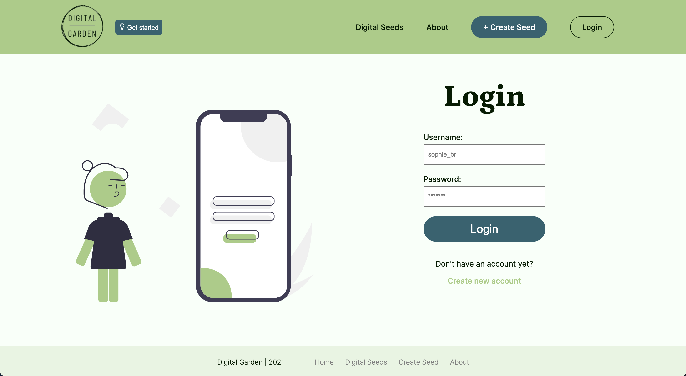

# Digital Garden

## Deployed version

You can visit the deployed website here: [Digital Garden](https://digitalgarden-knowledge-base.herokuapp.com/)

This web application was created as the final project for the Upleveled bootcamp in Vienna.

## Vision

The Digital Garden is a pinboard where users can capture all the resources that are meaningful to them. It also makes it easier for them to retain their key take-aways by creating meaningful connections with their personal experiences. Users can decide, which part of their notes is public and which one is only visible to them.

## Functionalities

- User authentication (registration + login)
- User authorization (only the owner of items is allowed to modify or delete seeds and to see private notes)
- Users can create seeds and select a category, save the resource URL and their main take-aways (= public note) as well as a private note, which is only visible to them.
- A user can edit and delete their seeds
- A rich-text editor enables the user to format the text
- Users can see seeds (= resources) of other like-minded people, get inspired and grow their knowledge base
- Also unregistered users can see all seeds of all users, but they cannot edit or delete seeds of other users
- Users can filter by category or by only their seeds
- The website is fully responsive, so access on the mobile phone is possible
- The website includes a product tour

## Technologies

- Next.js
- React.js
- PostgreSQL
- Emotion
- TypeScript
- Jest tests
- Cypress tests

## Project Management

- Database schema created with DrawSQL: [See schema](https://drawsql.app/final-project/diagrams/final-project#)

- Task management with Trello

- Wireframing and design with Figma

## SetUp instructions

To work on this project by yourself, please follow the upcoming steps:

- Clone the repo to your local machine with `git clone <repo>`
- Setup the database by downloading and installing PostgreSQL
- Create a user and a database
- Create a new file .env
- Copy the environment variables from .env-example into .env
- Replace the placeholders xxxxx with your username, password and name of database
- Install dotenv-cli with `yarn global add dotenv-cli`
- Run `yarn install` in your command line
- Run the migrations with `yarn migrate up`
- Start the server by running `yarn dev`

## Deploy your own website to Heroku

The easiest way to deploy your Next.js app is to use Heroku.

- Sign up for Heroku: [signup.heroku.com](signup.heroku.com)
- Create a new App
- Choose a name and select the "Europe" Region
- Click on the button in the middle called "Connect to GitHub"
- Search for your repository in the search box at the bottom of the page and click on the "Connect" button Click on the button for "Enable Automatic Deploys"
- Go back to the Overview tab and click on "Configure Add-On"
- Search for "Postgres" and select "Heroku Postgres" from the results
- Trigger a deploy by pushing your repo to GitHub
